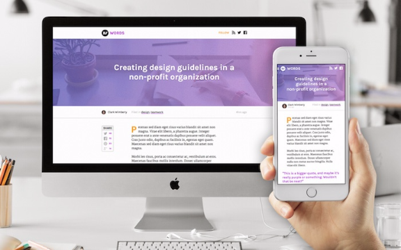

# Chapter 1 of 10 - Design Workflow with Sketch
#to read/Design Workflow with Sketch#

# Design Workflow with Sketch

It's a poor craftsman who blames his tools, but we all know having the right tool for the job makes things go **significantly** smoother. [Sketch](http://sketchapp.com/) is the right tool for my job.

Somewhat the new kid on the block, Sketch has seen rapid uptake into even the most complex design environments thanks to its numerous features made with the modern designer in mind.

Some of my favorite hits include:

**Made for screen designers.** Sketch is one of the few apps that's built from the ground up for screen designers. thanks to its heavy focus on organization with pages, artboards, symbols, and styles.

**It's resolution independent.** Sketch is a vector-based program, which means everything is based on infinitely-scalable math, not raster pixels. Combine this freedom with pages and artboards, and you can scaffold even the most complex applications.

**High-speed and flexible workflow.** The way Sketch exports files changed my life. That's not hyperbole. Along with near-perfect export tools, there's a plugin community unlike any I've seen. The engineers on your team are gonna flip!

## Who is using Sketch?

Spoiler alert: everyone.

Sketch is in place in full-production mode at some of the world's biggest startups and enterprises. Since we added support for Sketch in InVision, we've seen brands like Twitter, PayPal, and IBM use it to create some truly stunning work.

When Google debuted their new Material Design system, they even released an official .sketch file filled with material elements. If you haven't seen it, [take a look](https://www.google.com/design/spec/resources/sticker-sheets-icons.html) —it's amazing.

*"Sketch is an awesome minimalist app focused on UI design. There’s none of that image-editing sh*t in there. The team really loves it. **It helps us be as fast as we can possibly be**."*
– [Joshua Porter](https://twitter.com/bokardo), Director of UX at Hubspot

## What we're building

In this 10-part series, we'll follow the designer's role from initial assignment to production website, designing everything in Sketch. Along the way, we'll make use of all the bells and whistles, giving a full picture of the potential inside Sketch.

We're diving into some of the finer features of Sketch, including:

* **Pages and artboards:** infinite work spaces inside a single file, for all screen resolutions, and easily organized? It's a screen designer's dream!

* **Symbols:** reusable groups of elements that keep your design in sync and save time when making sweeping sets of design changes (so fast, sometimes I make changes during a design meeting)

* **Type systems:** style, define, and name all of your text definitions, allowing you to apply matching type styling anywhere in your document

Words, an editorial site

We'll walk through the design of **Words**, a hypothetical editorial site designed in Sketch. Our [sample .sketch file](https://s3.amazonaws.com/www-assets.invisionapp.com/words-kit.sketch) contains everything a developer needs to get started on the build, including responsive states and a style guide complete with colors and font sizes.

In the styling of today's editorial sites, we'll build in multiple article layouts, photograph stylings, advertising options, and more. Everything we make will be available in 2 sizes (mobile and desktop), and we'll keep our artboards and symbols separated as such.

Once our .sketch file is ready, we'll take things into InVision, where we'll build a working prototype and collaborate with our team through launch.

## Prerequisites

To complete this course, you'll need: **Sketch** and **InVision**.

Sketch is available for [$99 via the Bohemian Coding site](http://sketchapp.com/). It's worth noting that Sketch is available for Mac OSX only. Windows users are welcome, too, because we'll be discussing a ton of other workflow-related stuff. Grab the [sample .sketch document here](https://s3.amazonaws.com/www-assets.invisionapp.com/words-kit.sketch).

InVision is available [free forever](http://www.invisionapp.com/). It's an online tool, so anyone with a browser can participate.

Got 'em both? Then you're ready for chapter 2, and that's coming soon.