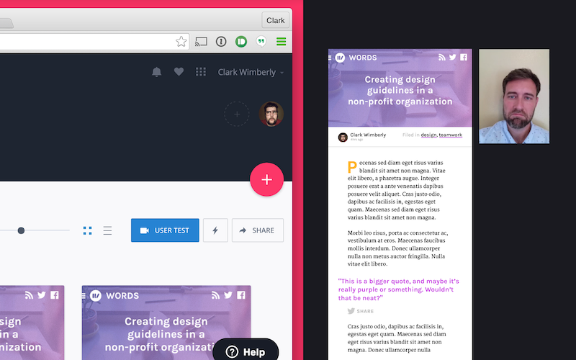
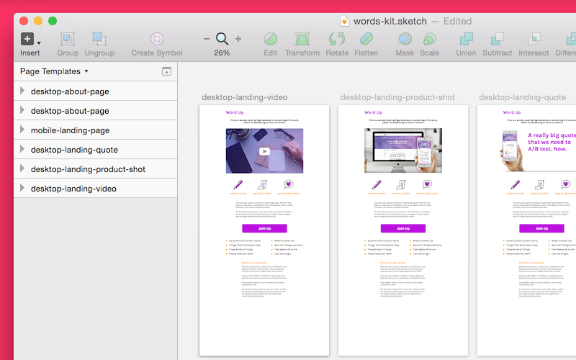

# Chapter 10 of 10 - Design Workflow with Sketch
#to read/Design Workflow with Sketch#

I used to think that a successful launch meant it was time for celebration and relaxation. Over the years I've learned that post launch is a crucial time—a period filled with surprises and quick fixes.

Often the launch process and following aftermath is engineer-heavy, but

## Measure, measure, measure!

When the design is live in the wild, it's time to start tracking its performance. There's a bunch of ways to do this, but these are some of my favorites:

User testing with real, live folks

With all the planning and design thought in the world, you can't replace testing on real, live people. They're going to surprise you every single time.

Of course, user testing can happen before launch, but more often I find myself crunching it in right after (dang deadlines!). And sometimes, depending on the sensitivity and privacy of the project, it's just easier to share with the public after launch.

Some of my favorite user testing is old school, like simply standing over someone's shoulder while they use my app. It's fun, enlightening, and only a little bit weird. For times when IRL isn't available, user testing hops into the cloud.

Once again, InVision's got your back. With user testing powered by Lookback, you can actually watch users interact with your prototype. You'll get a full recording of the screen during the session, along with video and audio once the user consents to the recording.

To get things going, you'll need a [Lookback](https://lookback.io/) account and SDK token. Once you've got that ready, hit the User Testing button to share your mobile project.

Using the user testing feature requires the [InVision Viewer](https://support.invisionapp.com/hc/en-us/articles/205503919-User-Testing-and-the-InVision-Viewer-app) for iPhone 6 or 6+.

Use analytic events to track the user flow

This one might require some help from a developer, but most analytics tracking allows you to set up custom goals and events, which is perfect for figuring out which part of your design is *confusing* your users.

It works like this: an event is a tiny signal tracked by your analytics when a certain step has been taken by a user. If there's a few steps, it's often called the *funnel* or *flow*. For example, with a signup form, you might track events at the form entering the screen, the user focusing input on a form element, and the user clicking submit.

If you notice a large disparity between the user events that start the form and the user events that click the submit button, you might need to work on your form design, copy, or clarity.

When you notice obvious snags, a few design tweaks might be just the fix. If the data is far less clear...

A/B test when you're not sure

, and lots of time we do that with baby steps in the form of A/B testing. Also called multivariate testing, it's a way of comparing differing design solutions over a period of time and measuring the performance of each.

Ultimately, A/B testing can be a very technical and data-driven process, but it all starts with design. That's what we're going to cover here.

## Making a design revision with Sketch and InVision

In our sample .sketch file, we've got a landing page featuring a video in the main space. As an A/B test, we're going to try swapping that with a few other feature treatments. This is a simple example, but the process remains the same.

Creating a few artboards (use CMD+D to duplicate) for new design edits is a great way to test things in an isolated space.
* **Duplicate the artboard you're planning to edit.** Make sure you also update the name to something descriptive. If you're doing a ton of variations, you might want to take things to a new page in Sketch.

* **Make your design edits one at a time.** Each incremental change should get its own artboard since you'll want to test these changes individually to get the best data on what works.

* **Share your proposals with the team.** Upload these new ideas into your InVision prototype and share them with the team. If needed, make a Tour or have a LiveShare meeting.

* **Make your bets!** Discuss which variant you think will perform best, and why. Dig deeper with comments and suggest other variations to add to the A/B test.

* **Launch, measure, repeat.** With some test variations in place, keep an eye on the data to decide on your future moves—and the moves after that.

# Design workflow with Sketch

This series is coming to a close, but we've only scratched the tip of the Sketch design workflow iceberg. The lessons here are meant as a loose guide, so apply them in any way that improves workflow with your team.

Some parting shots:

Share your design process with anyone who will listen.

Sketch lightly and carry a big stick. Be ready to go to bat for your decisions, but be ready to change things when it's clear there's a better way.

Start the process early and prototype like crazy. The quicker and easier it is to picture something, the less chance for miscommunications that slow down builds.