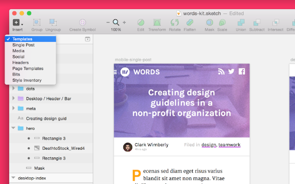
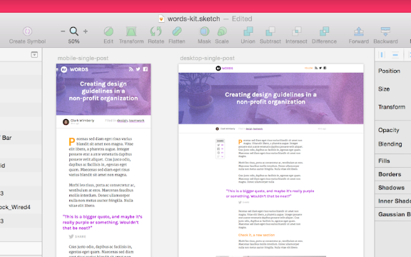
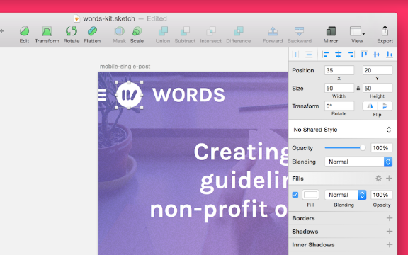
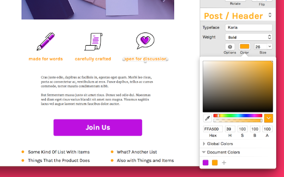

# Chapter 2 of 10 - Design Workflow with Sketch
#to read/Design Workflow with Sketch#

—that’s one of my favorite things about it. An entire website or app, complete with endless pages and views, all stored inside a single, shareable .sketch file.

In this session we'll look at the main players in our Sketch toolbox: pages, artboards, and styling. We'll use these tools to create a base file from which we'll build our site.

## Pages

A page is an individual canvas area inside a single .sketch document. Pages are the top level of organization in the document hierarchy, which is stacked like so: **Document > Pages > Artboards > Layers**.

Pages are perfect for keeping even the most complex build organized. You can move from page to page with the menu at the top of the Layers List.

Use the dropdown menu to navigate between pages in your document. Notice that not all my Sketch pages are literal pages, like in a website. I use pages for all sorts of high-level organizing.

While pages give you separated space to work and focus, Symbols and Styles will work cross-page just fine, making consistent styling across your whole document a snap.

A document can hold infinite pages, so don't be shy when creating them. Try treating Sketch pages like branches in development: a new area to test things out without affecting your master design. , and Sketch pages make it super easy.

## Artboards

An artboard is a fixed-size frame inside a page, and they help group and organize screens while working on Sketch's infinite canvas. Artboards are great when working with responsive design, because you have multiple screen sizes sitting right next to each other.

Here's a look at artboards in use inside our sample document:

Artboards are also made for exporting, which makes saving and sharing screens a snap. InVision can automatically sync your artboards into screens of your prototype.

Making a new artboard

To create an artboard, simply select **Insert > Artboard**, or press the **A** key. When creating a new artboard, Sketch provides a lot of predefined sizes (common device, icon, and screen resolutions).

If you've already got an artboard in place and want another one (handy for creating a new view from an existing screen), select the artboard and press **CMD + D** to instantly duplicate it.

Sometimes when I'm working on a complex flow, my pages will contain dozens of artboards laid out in a logical flow. It's a great way to picture the user funnel while working, seeing everything in one space.

## Styling

All styling (colors, fonts, sizing, fills, borders, etc.) in Sketch is contained in **The Inspector**, a glorious sidebar that helps keep in the craziest layouts in check.

As a quick example, let's take a look at the Inspector when we've got our logo shape selected:

Check out the exact pixel location, width and height, opacity, fill, and more. The Inspector contains everything you could possibly want to know about or edit for any selected element.

Every single bit of styling info for the element is shown all at once, in an organized and manipulable interface. If you've ever done any front-end development, you should feel right at home here.

Saving brand colors for easy use

Sketch's color palette tool makes it really easy to save and reuse colors, perfect for keeping things on-brand as you hop around the document. You can save colors to the document (available on all Pages), or globally to Sketch itself (available in all documents).

In our sample .sketch file, I've saved our key colors (purple and orange) into the Document Colors for quick and easy reference.

To save a new swatch, start by selecting your desired color (either by entering a hex value or using the picker). Next, just click the + icon under the "Document Colors" or "Global Colors" section. Your selected color will be added to the list of swatches, ready for use.

Bonus: even if you haven't saved any colors, Sketch keeps track of colors you've used and how often you've used them. To pick from your frequent colors, use the dropdown arrow hidden inside the color preview well (the block of color showing the currently selected color).

## Creating our document (all together now!)

With our new-found appreciation for pages, artboards, and styles, let's go ahead and set up our .sketch document scaffold. Since our news site is going to be responsive, we'll make both desktop and mobile sized artboards as we go.

Let's get started by thinking about what sections we're going to be designing. We'll talk more about that in the next chapter.