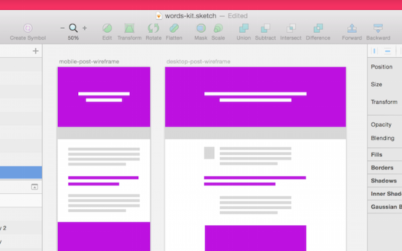
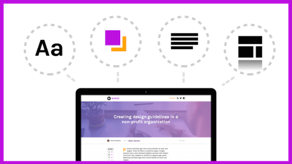

# Chapter 3 of 10 - Design Workflow with Sketch
#to read/Design Workflow with Sketch#

Before we can jump into the tastier design details, a good amount of project planning has to happen. From the kick-off meeting to the first design review, there's a **ton** going on, and the designer should be on top of it all.

It hasn't always been that way, but Business goals affect design, while design affects conversion. Development timelines affect design, while design often sets the development timeline in the first place. It's hairy.

To combat the confusion, the design process has been cracked wide open and shared with the whole team. , surfacing and acting on the great suggestions while gracefully skirting the bad ideas.

## Ask lots of questions

While it might sound contradictory, I ask *lots* of questions. Asking questions and listening carefully to the answer is my main value as a designer.

While things vary from project to project, some questions always seem to fit. Here are some of my favorites, along with why/how I use them:

* **What are our goals?** Believe it or not, it's sometimes hard to put the point of a project into words. Getting beyond "make it look better" and into the real goals and expectations of a project is key to understanding what direction to take the design. Along with goals, it's good to talk about the specific results that would deem the project a success. Looking for more time on-site? What design solutions can directly lead the user that way?

* **What sites/apps do we like?** Why? [Collecting a wide array of samples and inspiration is a great way to start a project](https://twitter.com/intent/tweet?text=%22Collecting%20a%20wide%20array%20of%20samples%20and%20inspiration%20is%20a%20great%20way%20to%20start%20a%20project%22+http://bit.ly/1VJg2Kh%20via%20@InVisionApp)

* on the right foot. It's all too possible for a room of smart people to leave a conversation with 5 different opinions on direction. Rounding up a bunch of specific designs and talking about the merits of each is the perfect way to find common ground.

* **What's our timeline?** This one is a bit tricky, because in my experience, the answer is always *"As soon as we can."* Crack the ideal nut and start talking about things like development resources, marketing availability (for copy, content, approval), and real launch dates. If you have no idea how much time you have, it's hard to know if you're spending time correctly.

Asking good questions and digesting the answers will determine where the project goes. Maybe more importantly, an agreed-upon vision helps keep things on track when arguments or scope creep rear their ugly heads. If a new feature or design request doesn't align with the project goals, kindly suggest tackling it post-launch.

## Wireframing and quick sketching

Continuing the *let's get everyone on the same page before we get too deep* path of reasoning, it makes sense to start with a wireframe and some quick mockups before you dive into the hi-fi meat of the design tasks.

Our sample project is an editorial site in the styling of Medium or the InVision blog, so the star players are probably pretty recognizable. We'll need a modular system consisting of things like:

* a type system, for displaying articles with a solid hierarchy

* a navigation system, like a header and footer, for moving between articles and sections

* media handling, for large images and galleries

* responsive design, ready for mobile or desktop consumption

To make sure we've got all the general ingredients, I've constructed wireframes of a couple key views in the project. Consisting of the index view (listing of articles) and single article view (page showing a specific post), here's what some of our wireframes look like:

Wireframes of the single article view, at mobile and desktop resolution.

Armed with some simple wireframes, we can return to our team to make sure this was what everyone had in mind. Since this is an imaginary project created by me alone, I think we're looking pretty good!

## Our deliverables

So, with all that in mind: what are we (aka *the designer* ) actually on the hook for? We'll look to deliver our design in 2 ways: a robust .sketch document, and a working prototype built in InVision.

InVision is a prototyping and collaboration tool that's grown indispensable to my workflow. It allows me to easily move from Sketch to working prototype—with no code. and a smoother process for all involved. Win!

## Design like a developer

One of my favorite things about Sketch is the modular way it lets me look at design. Often, instead of starting with the goal of "designing a homepage," I'll start with smaller decisions and work my way up.

Some folks call this [Atomic Design](http://patternlab.io/about.html), the act of making small bits of design and connecting them into larger structures. Call it whatever you want—Sketch makes it amazingly easy to assemble web and product design like LEGO.

Let's drill all the way down: we're designing an editorial website, which is made up of posts, which are made up of content and images, which are styled with fonts and colors.

The whole process might look something like this:

From left to right, all of our design decisions work together to create a design system, flexible enough to handle just about anything.

Over the next few sections, we'll look at symbols, styles, and type systems, our arsenal for taking a big bag of design snakes and laying them out straight.