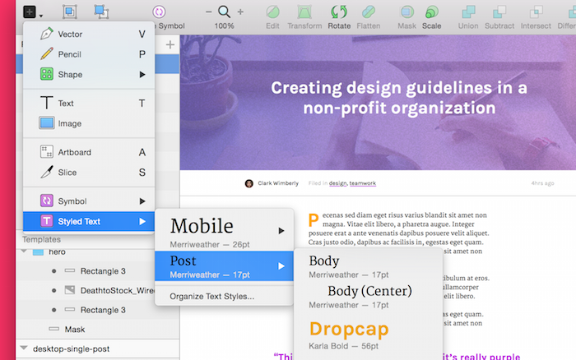

# Chapter 4 of 10 - Design Workflow with Sketch
#to read/Design Workflow with Sketch#

Shared styles in Sketch are special reusable styles that you can use to repeat font sizing, color, and spacing around your document. For instance, it's easy to save a style that makes the header *blue* and *bold* on every screen you design.

If you're familiar with front-end development, imagine these styles like CSS—rules that you can apply to some (or all) of your document. When you need to make a change in one place (like changing the header text from *blue* to *red* ), it'll instantly be reflected around the document. Talk about a time-saver.

When inserting new text in your document, you can pick from a visual menu of your existing type styles, complete with font family and size info.

Just like CSS, it's key to pick out which text elements are reusable enough to deserve a shared style. Some of the usual suspects:

* Heading text

* Subheading text

* Body copy

* Large callout text, like blockquotes

* Menu items

Creating a document that's based on shared styles is smart for all sorts of reasons. It saves time when making document-wide changes ( *hello, design review meeting!* ), it makes sure all the nooks and crannies of your file still match ( *goodbye, forgotten loose PSD!* ), and it gives you something to export for your developers (more on that later!).

## Creating a new shared type style in Sketch

Creating a new type style is pretty simple. With the target text layer selected, go to **Layer > Create Shared Style**. You can also find the **Create New Text Style** action in **The Inspector**, in the type style dropdown.

The Inspector provides a dropdown menu that allows you to quickly select an existing style or create a new one.

With type styles in place, it's easy to make sure your entire document is in sync and up to your design standards. A text element that has a shared style applied to it will show up purple in the layers list, so keep an eye out.

Keep an eye out for the purple icons in the layers list. The purple Aa is a shared text style, the purple folder is a symbol.

Once you've got a few type styles created, there's a few ways to apply them. You can select an existing layer and use the dropdown in The Inspector, or you can select **Insert > Styled Text** from the toolbar.

## Updating a shared type style in Sketch

To update a shared style (and all other instances of the style), simply change the styling of a text element that has the style applied. Any changes you make to an element, like typeface, font size, color, line spacing, etc. will be automatically applied to the text style, which means all your other layers will update.

Left: A pair of headings each using the same type style. Right: Changing the color of the text on top automatically changes the color of the text below.

Updating a shared style is a totally awesome—and scary—practice. With a couple clicks, your entire document can look different, for better or worse. When changing things up, keep the following rules in mind.

**Keep track of which styles are used where.** Before you update a style, do a quick mental inventory of the items you're about to affect. If you're too loose when applying your styles the first time around, you might end up unexpectedly changing more than you meant to.

**Try it on a detached element first.** Before committing your new style to your entire document, select a target text element, then detach it from the shared style in The Inspector, by selecting **No Text Style** in the dropdown. Now, any changes you make stay local. When you're confident, reapply the target style, then reapply your changes, which will be synced document-wide.

## Organizing shared type styles in Sketch

If you'd like to see a list of all the text styles in the document, select Organize Text Styles from the type style dropdown in The Inspector. You'll get a modal that shows all the type styles in play, as well as the ability to delete. This won't get rid of the layers, just the style associated with them.

The visual layout means well, but things can get hairy fast. Use descriptive names to keep your sanity.

Similar to *symbols*, it's possible to file shared styles into folders through the use of slashes in the style name. For instance, creating a new style with the name of Mobile / Header would create a style named Header in a folder named Mobile.

I keep my text styles in folders for various reasons, the main 2 being:

* **Category / Section:** sometimes I'll split my text styles up by major section (homepage to marketing landing page to app screens)

* **Resolution:** often I'll split my text styles by resolution, saving slightly different sizes for mobile, desktop, and beyond

Just like practicing good code maintenance, it's important to clean up loose styles as you no longer need them. **You** might be able to keep it straight, but for the developer down the line, it might not be so clear.

## Setting up our type system

We've got a pretty simple type system going in the sample .sketch file, consisting mostly of Google Fonts set in 2 sizes (mobile and desktop). The fonts are [Karla](https://www.google.com/fonts/specimen/Karla) and [Merriweather](https://www.google.com/fonts/specimen/Merriweather), which you can grab from Google Fonts.

Inside our [sample .sketch file](https://s3.amazonaws.com/www-assets.invisionapp.com/words-kit.sketch), I've defined styles for all the key players: titles, body copy, section headings, etc. Armed with these type styles, knocking out new pages and mockups gets quicker and quicker, with each new page looking as sharp as the last.

In the next chapter, we'll learn all about using symbols in Sketch.