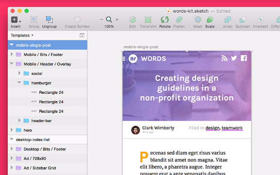
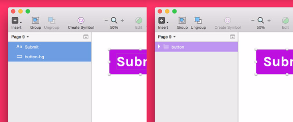
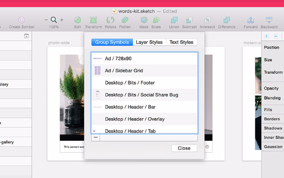
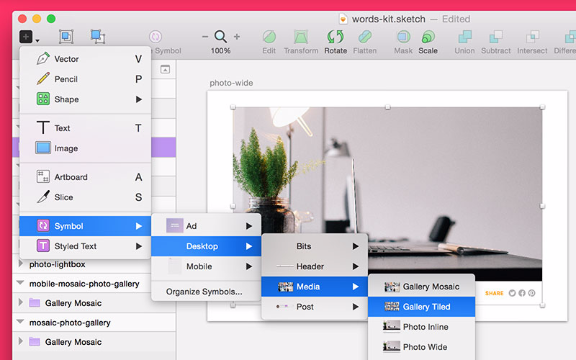
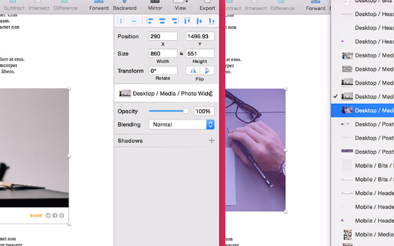
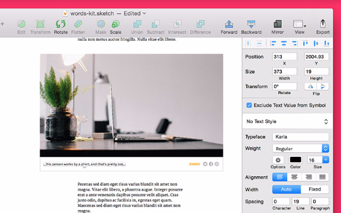
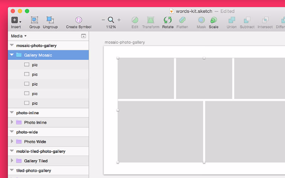
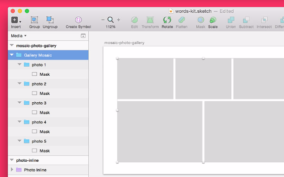
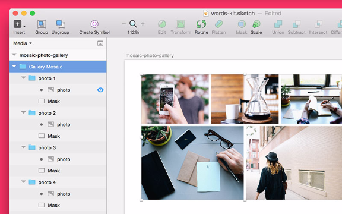
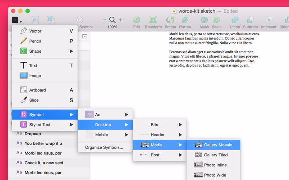

# Chapter 5 of 10 - Design Workflow with Sketch
#to read/Design Workflow with Sketch#

Symbols in Sketch are special elements you can use again and again throughout your document, across pages and artboards. It's basically a magical layer group, and it's denoted in the Layers List by a purple folder (instead of the usual blue).

Symbols around your document automatically stay in sync, so when you change one, all the others instantly fall in line. It's a **perfect** tool for prototyping apps and views when elements are repeated over and over, like a social stream, inbox, or track listing.

From a developer standpoint, reusable modules are nothing new. When you code something, best practices (and common sense) say that your code should be flexible and reusable. It not only saves time in development when you get to reuse something, but it makes for a more consistent build.

[Using symbols while designing will save time and help you arrive at the big picture faster](https://twitter.com/intent/tweet?text=%22Using%20symbols%20while%20designing%20will%20save%20time%20and%20help%20you%20arrive%20at%20the%20big%20picture%20faster%22+%C2%A0http://bit.ly/1VJg2Kh%20via%20@InVisionApp)

  and more realistically than you previously thought possible.

Which part(s) of my design should be a symbol?

The tricky part is deciding which bits of your layout should be converted into a symbol. They key is to look for pieces that repeat again and again, and aren't *too different* in each instance. Thankfully, Sketch gives you the power to adjust certain things within a single symbol:

* text content

* opacity

* shadow

* blending mode

If you need to change anything else from instance to instance, a symbol might not be the right choice (or, you might need a symbol + a few other groups, which would be fine and dandy). One major thing you can't change within a single symbol instance is an image, so make special plans when laying out things like photo galleries and media objects.

Look for repeating styles and positions, something you'd write some utility CSS for. Things like:

* menus (and menu items)

* lists of messages

* widgets

* headers and footers

* cards

Changing the background color of the header on 56 pages shouldn't take 56 clicks. Once you get started, you'll never look back.

## Creating a symbol in Sketch

Creating a symbol is simple. You can make them from existing layer groups or loose layers. If you select a bunch of loose layers, Sketch groups them for you when creating the symbol.

With the desired item(s) selected, click the **Create Symbol** icon in the toolbar, or select **Layer > Create Symbol** in the menu. If you've got a group selected, you can also right-click in the Layers List and select **Create Symbol**.

Left: 2 layers selected, elements that make up a button. Right: elements converted into a symbol, named button.

To use the symbol you've just created—or any symbol in the document—select **Insert > Symbol** in the toolbar. Just remember: any changes you make to your new symbol will be immediately reflected in the other instances. With great power comes great responsibility.

## Organizing symbols in Sketch

Once you've got a bunch of symbols in play, using them efficiently requires a bit of organization. Select **Insert > Symbol > Manage Symbols** to see a complete list of all symbols contained in the document. You can also rename and delete symbols from this view.

Creating groups of symbols in Sketch

You can also create nested groups of symbols, which is great for organizing even the largest design library. By adding a slash in the symbol name, like **buttons/submit**, you'll end up with a symbol named *submit* contained in a folder named *buttons*.

When inserting a symbol, the folders provide drill-down organization, making it easy to find just what you're looking for (sometimes my files have hundreds of symbols).

There are lots of ways to organize your symbols (just like code!), but I usually use them in the following 3 ways:

* **Category:** split my symbols up by context, like all the form items in one folder, all the gallery items in another

* **Resolution:** split my symbols up by breakpoint, with symbols in folders by device screen size

* **Versioning:** when making a new symbol with wildly different styling, sometimes I'll put it in a *test* or *experimental* folder to keep my *production* symbols clean

Swapping symbols in Sketch

Sketch also gives an easy way to swap one symbol for another, perfect for exchanging symbols that are similar to each other (like swapping a solid header for a modified transparent one).

Left: a symbol in place, Right: Selecting a new Symbol, in this case swapping an image placeholder for a video placeholder.

With the target symbol selected, find the symbol dropdown inside The Inspector (the panel on the right side of the screen).

## Tweaking individual symbols in Sketch

While most everything about a symbol is kept in sync around your document, there are a handful of values you can change at an instance level, meaning they won't affect other copies of that same symbol.

Changing text content in Sketch symbols

One key to making a realistic prototype: use real (or real-looking) content in all your screens. An inbox full of *blah blah blahs* looks way less convincing than sample emails from a believable guy named Steve.

To make changes inside a single instance of a symbol, select the target text layer and check the **Exclude Text Value from Symbol** option in the Inspector. Now, any changes you make to this text layer will stay local to this instance of the symbol.

When *Exclude Text Value* is checked, you can do handy things like change each caption or change the value of a button from page to page.

[Filling a mockup with real content goes a long way to winning project approval](https://twitter.com/intent/tweet?text=%22Filling%20a%20mockup%20with%20real%20content%20goes%20a%20long%20way%20to%20winning%20project%20approval%22+%C2%A0http://bit.ly/1VJg2Kh%20via%20@InVisionApp)

  (sorry, lorem ipsum!), so I always take the time to vary the text values from symbol to symbol.

Changing styles of Sketch symbols

As mentioned earlier, Sketch lets you control a few key styles independently, which is helpful when creating various states (status, active/inactive, hover, etc.). Changes to any of the following will only affect the specific instance, not all symbols:

* **Opacity:** change the overall opacity level for the symbol and all contents

* **Shadow:** add a shadow (or shadows) to the symbol as a whole

* **Blending mode:** change the blending mode (overlay, screen, etc.) of the symbol

This is a pretty recent change, coming in Sketch 3.3, but I'm already finding it helpful in cutting down the sheer number of symbols I've got working at any given time. Sometimes an inactive or completed item just needs a simple opacity drop, not a completely separate symbol.

## Creating a symbol from Scratch

One thing we planned in this design (from our "Design Planning" section) was solid media handling, which means the ability to nicely display an image, group of images, video, and more, any time an author needs them.

In our Sketch document, these are all going to be symbols. To get started, we're going to make a mosaic gallery, something that lots of posts and layouts might need, and something we definitely don't want to build again and again.

I'm picking the mosaic gallery because it involves a neat treat using layer masks, which will definitely save time when working with random images from the internet.

Using the Rectangle Tool (Insert > Shape > Rectangle), draw out the grid where you want your images to sit. Notice we're planning with rectangles, not actual image sizes. If you wanna get really specific—and I did—you can size things pixel-perfect using The Inspector.

With the grid in place, add each shape to its own group (select the shape and press CMD+G). Inside of each group, right-click on the shape and select Use as mask. Each rectangle is now ready to contain a single image from your gallery.

Paste an image into each group, making sure to keep it on top of the mask layer. Masks work by containing any elements sitting above itself in the same group (which is why I had you group everything first). Using shapes as masks cuts out the huge annoyance of having to size each random image specifically, since you already have a grid ready and waiting.

Select everything you've just created and convert it to a symbol, either by clicking the Create Symbol icon in the toolbar, or select Layer > Create Symbol from the menu. Your new Symbol is ready to insert all over your document (above, I've utilized nested folders to keep everything organized).

I'm not sure how else to say this: having a Sketch document with a library full of ready-made symbols is an absolute delight. It's like a drag-and-drop sticker sheet filled with your own high-fidelity design.

Next time, we'll talk about creating a hi-fi prototype with Sketch and InVision.