# Chapter 6 of 10 - Design Workflow with Sketch
#to read/Design Workflow with Sketch#

We've got a handful of beautifully designed screens, and it's time to share. Almost as quick as you can draft an email, InVision lets you build a working prototype. With a little finesse—and no code—we can build a prototype that will convince even the pickiest of clients.

Even better, InVision integrates with the design tools you're already using (Sketch, in this case), which allows us to easily keep our prototype up to date with our design document.

Prototype vs. static screens

Even a few years ago, I wasn't in the habit of delivering a working prototype as part of the design process. Normally, I'd disappear into a hole and come back with a bunch of finished PSDs ready for the engineers to dissect.

A prototype allows interaction, and static screens make the viewer imagine the steps. A prototype can be viewed on a native device (or in a device wrapper), and static screens come zipped in an email. A prototype is a working map that a developer can follow, and static screens require a bunch of notes and extra meetings.

If you're a designer who's unfamiliar with prototyping, this might sound like something you'd expect the engineers or front-end to tackle. Actions? Animations? Workflows? Welcome to modern design.

[Producing a prototype gives the entire team a milestone and kickstarts the product conversation.](https://twitter.com/intent/tweet?text=%22Producing%20a%20prototype%20gives%20the%20entire%20team%20a%20milestone%20and%20kickstarts%20the%20product%20conversation.%22+http://bit.ly/1VJg2Kh%20via%20@InVisionApp)

  Anything we can do to more clearly communicate the intent of our design is a win—and in this case, it's a **big** win.

Before we get started, you'll need an InVision account, but I've got you covered. Here's a link for [3 months free](http://www.invisionapp.com/signup/threemonths) for new users. Everyone good? Logged in? Let's roll!

## Starting a new InVision project

Before we can get to prototyping, we need to create a new project inside InVision. Head to your [Projects](https://projects.invisionapp.com/) and look for the big pink button.

Projects are defined by device, allowing you to select options like desktop, tablet (iOS + Android), phone (iOS + Android), and watch (iOS + Android). Punch in a name, and let's get started with a desktop project.

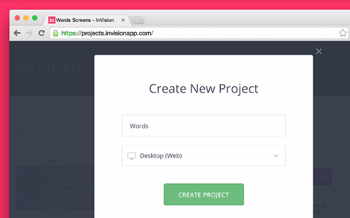
We're getting started with the desktop version, but you'll want to repeat this process for the other prototypes you want to make (mobile, tablet, or *watch*, if you're feeling frisky).

## Use Selective Sync

With a new project created, you'll need to add some screens. You can drag and drop into the browser, but a better solution is setting up automatic syncing with one of the supported cloud services.

I use InVision's [Selective Sync](https://support.invisionapp.com/hc/en-us/articles/205199975-What-is-Selective-Sync-), which is perfect during the busy design process, where little changes come fast and furious.

You can use Selective Sync with **Google Drive**, **Dropbox,** or **Box**. Whichever you use, take a few minutes to get Selective Sync set up—you won't regret it.

## Building a prototype

With a new project created and syncing set up, we're ready to build our first prototype. To get started, we'll build out a couple of basic interactions: moving from page to page and opening an overlay.

Our basic prototype is going to consist of 3 states: the blog index, a single blog post, and a photo modal overlay that's launched when someone clicks a photo inside the blog post.

Exporting screens and assets

First up, we're going to need to export our 2 main artboards, specifically *desktop-blog-index* and *desktop-single-post*. They're located in the **Templates** page of my .sketch document.

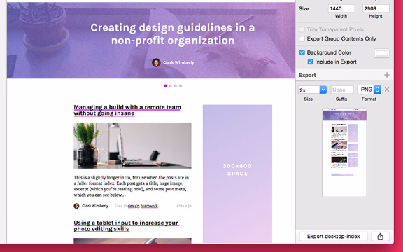
To export an artboard, first select the artboard then click the + icon in the Export tab inside The Inspector. Since I'm working on a retina machine, I'm going to export a 2x file to keep things sharp.
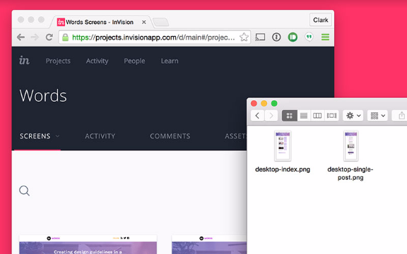
Save the files to the project folder inside your InVision Sync folder (or Dropbox, or Box). As soon as you save the files into your local folder (lower right), they'll be uploaded and reflected inside your InVision project online (left).Preview Mode

Click View Screen inside your project and you'll be launched into **Preview Mode**, which lets you view and interact with your prototype. This is the main view your team will see when you share an InVision link.

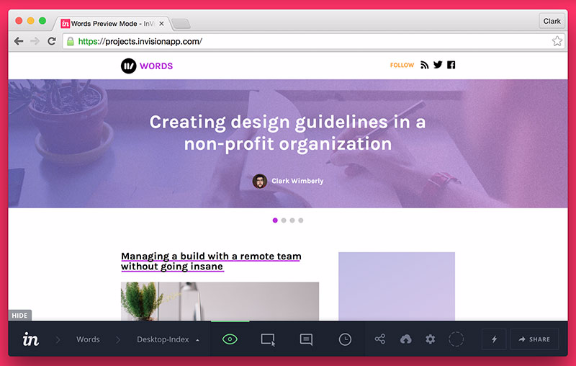
Check out the big green eyeball—it means you're in Preview Mode. You can easily swap between the 4 main modes with the following keyboard shortcuts: Preview Mode (P), Build Mode (B), Comment Mode (C), History Mode (H).

To actually make the prototype work like a real website, we'll need to add some hotspots, which we can do in...

Build Mode

Build Mode is where we tell our prototype how to behave. Before we kick off with some hotspots, let's do some housekeeping and set our fixed header. Our design calls for a solid white header, with the logo and social links, to remained attached to the top of the viewport.

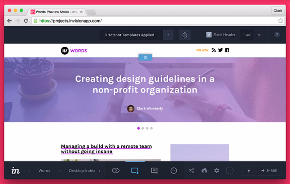
Adding a fixed header will keep our site header attached in place, even as the user scrolls. Little details like the fixed header add an extra hi-fi dash to your mockups. Also, take note of the blue icon in the bottom center—it means you're in Build Mode.

**Build Mode** is where we'll set up hotspots, the building blocks of functionality inside our prototype. Hotspots allow you to link areas of your screens to all the other areas of your prototype, all with just a few clicks.

With Build Mode active on our desktop-blog-index screen, let's make a new hotspot for the main featured post (the big purple area).

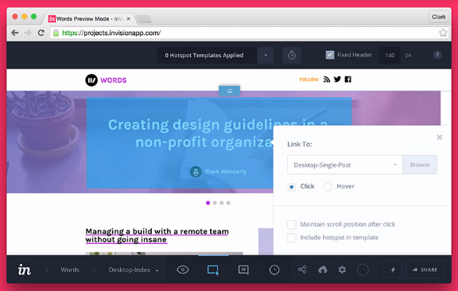
Click and drag to create a hotspot around the entire area. We want to ***Link To*** our single post screen, titled *desktop-single-post*. Save your hotspot and hop back to Preview Mode to test it. Now when a user views the index page, clicking the feature post will actually load the feature post view. Magic!
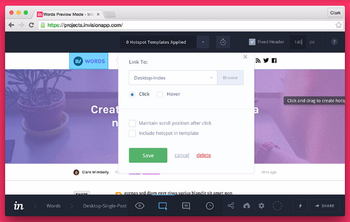
Once a user views a single post, we'll need to provide a way back to the index view. Let's add a hotspot to the main logo, linking to the *desktop-blog-index* screen. With this screen returning the favor, we've got a full loop where a user can view the homepage, click a post, view it, then return home.Adding an overlay effect
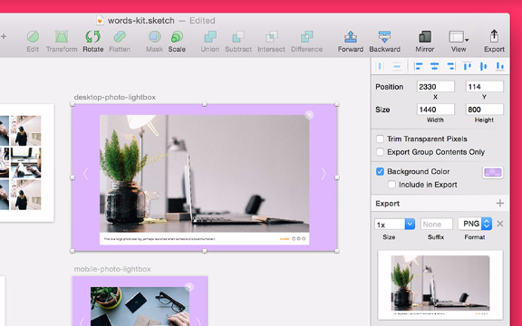
Start by exporting the artboard that has the overlay on it, *desktop-photo-lightbox*. In our .sketch file, I've included a light purple background effect on the artboard, but I don't want it on my exported PNG file, so I'll uncheck Include in Export in The Inspector.
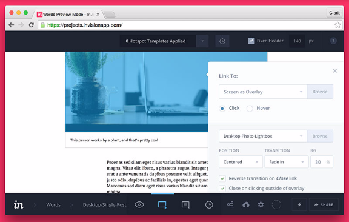
Fire up Build Mode on the single post view, and scroll down to the inline image. Draw out a hotspot around it and Link To a Screen as Overlay. Select our new *desktop-photo-lightbox* and configure the options.
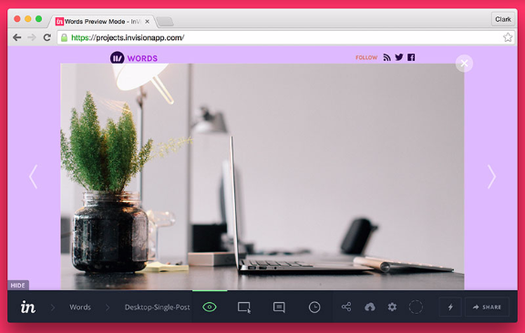
Hop back to Preview Mode to see the overlay effect in action. When you click the photo, a larger version should fade in, complete with a translucent background effect.
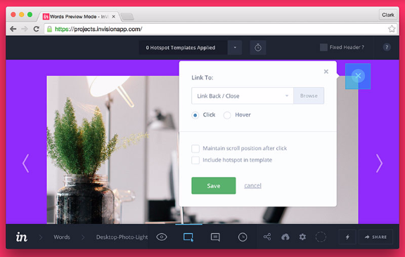
To complete the overlay effect, navigate to the desktop-photo-lightbox and enter Build Mode. Draw out a hotspot around the close button, and Link To: Close, which will get rid of the overlay.

## Updating a prototype

One of the best parts of making a prototype early in your design process is how easy it is to update and tweak things as you go. As you complete new designs, you can add new sections and functionality to your prototype with ease.

Just export the screens and overlays into your sync file and repeat the steps outlined above. Here's a few tips to consider when building out and updating your prototype:

* **Naming conventions matter!** When you save a screen with the same file name, InVision will track history and replace the current screen with the new one. It's really handy as you add incremental design changes, since your hotspots and actions all stay intact.

* **Use templates when adding lots of pages.** When you're adding screens with the same links appearing, it might make sense to use a Template in InVision. A template is just a collection of hotspots, which you can name and apply to new screens again and again. Huge time-saver.

## Wash, rinse, repeat

The more nooks and crannies of your prototype you can build out, the more high fidelity the experience will feel. Take the time to link up each post on the homepage and each set of prev/next buttons—it goes a long way to making the prototype feel like the real deal.

Stay tuned for chapter 7, where we'll talk about ways to go about getting approval.