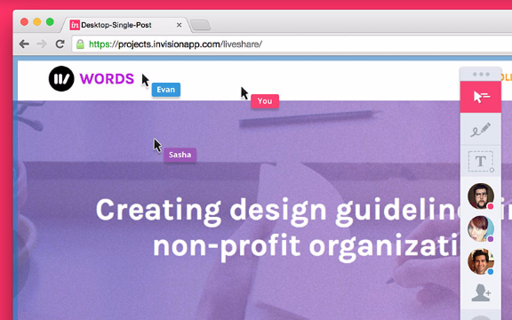
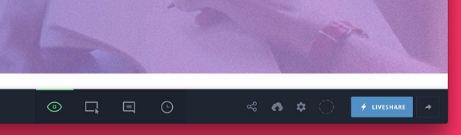
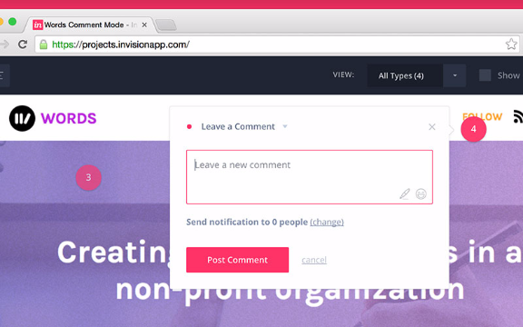
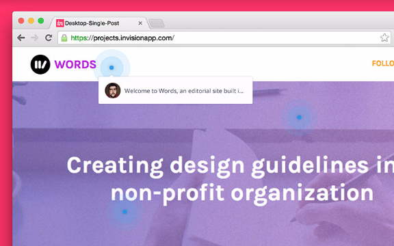

# Chapter 7 of 10 - Design Workflow with Sketch
#to read/Design Workflow with Sketch#

Once you've got a working prototype (or several) ready, it's time share with the team, collect feedback, and intelligently act on that feedback. Luckily for us, InVision takes this (previously) complex process and makes things pretty dang simple.

Beyond the prototype, we've built a slew of features that foster collaboration. In this section, we'll check out some of my favorite InVision tools, such as:

* **LiveShare:** invite multiple participants into a shared screen space for live feedback and exploration

* **Comments:** collect and act on feedback long after the design review meeting happens

* **Whiteboard:** sketch and doodle right on top of the current design, live with other team members

* **Tours:** create a step-by-step walkthrough that explains the ins and outs of your design thinking

Mastering these tools led me to an entirely new workflow, one that was much more open and efficient than I was used to. My designs were being more clearly voiced to the team, and the team's voice was coming back at me loud and clear.

## LiveShare

[LiveShare takes your design and prototype presentations to a whole new level.](https://twitter.com/intent/tweet?text=%22LiveShare%20takes%20your%20design%20and%20prototype%20presentations%20to%20a%20whole%20new%20level.%22+%20http://bit.ly/1VJg2Kh%20via%20@InVisionApp)

  With LiveShare, your entire team (or clients, stakeholders, etc.) can connect in the cloud to collaborate on design decisions—almost like being in the same meeting room.

With LiveShare, all participants can chat (voice or text message) while you control the presentation. It's a perfect way to host kickoff meetings and design walk-throughs, taking the entire room through your design thinking step by step, tackling questions as they arise.

A bunch of team members can pile into a shared space, each with their own cursor.

Even if you're physically in the same room ( *gasp!* ), LiveShare is a great tool for everyone to explore in a shared space. Each participant gets their own cursor, which is great for quick point-and-ask questions.

Starting a LiveShare

To start a LiveShare session, look for the LiveShare button (featuring a lightning bolt) while viewing your Projects, while viewing your list of screens, or while viewing the prototype itself.

To invite others to your LiveShare, copy the shareable URL presented to you when the session begins. You're on!

Getting everyone on my team on the same page is one of the most important tasks during a project, and LiveShare is one of my best weapons.

## Comments

Once the prototype has been shared and explained, it's time to collect feedback. InVision lets us do that in-context, with comments right on top of the prototype itself. What's more: your team can submit comments well after the initial meeting, perfect for those I'm gonna sleep on it moments.

Comments also come with threaded conversations, notifications, and a built-in status, so you can mark things *complete* once they've been dealt with. It's like a to-do app built right over my prototype, and it keeps the pulse of the project right at my fingertips.

Leaving a new comment

While viewing a prototype, switch to **Comment Mode**, either with the button in the bottom center of the screen, or by pressing the C key on your keyboard. Your cursor will switch to a crosshair, which means you're a click away from leaving some pinpoint feedback.

When leaving a comment, you can select which team members to notify, helping your other team members stay focused by not bothering them unless needed. You can even doodle right on top of the prototype (useful for circling things or drawing arrows) and insert emojis (useful for being a total ham).

Managing comment type and status

On top of basic comments, there are a few other types of comments that come in handy. When leaving a comment (and after), you've got the choice of:

* **Comment:** a regular comment for the team to see and reply to

* **Private Comment:** something for yourself, saved for later action

* **Dev Note:** a callout or sticky point you want the developers to notice

* **Tour Point:** a single stop on a Tour, which we'll talk about later

There's also a checkbox to mark the comment resolved, which is perfect for keeping track when you're implementing a lot of fixes based on feedback.

## Whiteboards

The whiteboard is a time-tested collaboration and ideation tool on the level with daily standups and Red Bulls in the break room. Of course, InVision's got you covered.

With Whiteboards in InVision, multiple participants can draw and illustrate ideas right on top of your prototype. It's perfect as a quick way to share design tweaks during a meeting—or you can start fresh with a literal blank whiteboard.

Starting a whiteboard session

**To use the whiteboard during LiveShare**, tap the marker icon and start drawing on the screen like you're John Madden going to town on the telestrator.

To start a **blank whiteboard** for sketching, wireframing, and mind mapping, look under the *Tools and Extensions* menu in the top-right corner of the Projects screen.

## Tours

When you've spent weeks getting your design game plan just right, explaining it cleanly is essential. If someone on the team can't make the LiveShare or IRL meeting, Tours gives us the next best thing: an easy way to make a step-by-step walk-through.

Tour points are marked by blinking blue beacons, walking viewers through each point, in order.Creating a Tour with InVision

To create a Tour, switch to **Comment Mode** and leave a comment like you normally would, selecting **Tour Point** as the comment type. Repeat around the prototype until you've explained yourself adequately, then share the prototype like your normally would.

Tour Points even come complete with threaded conversations, so your team can reply to some of the finer points while walking through the tour.

## Go forth and collaborate!

[Getting approval is much easier if the final design represents everyone on the team.](https://twitter.com/intent/tweet?text=%22Getting%20approval%20is%20much%20easier%20if%20the%20final%20design%20represents%20everyone%20on%20the%20team.%22+%20http://bit.ly/1VJg2Kh%20via%20@InVisionApp)

  Constant collaboration, in an organized fashion, leads to better products.

In the next chapter, we'll discuss *the handoff*.