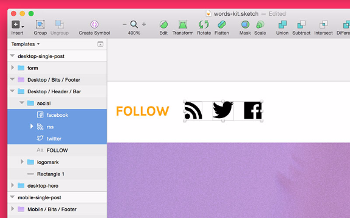

# Chapter 8 of 10 - Design Workflow with Sketch
#to read/Design Workflow with Sketch#

[The stickiest part of the process? Most designers and devs will say it's the handoff.](https://twitter.com/intent/tweet?text=%22The%20stickiest%20part%20of%20the%20process?%20Most%20designers%20and%20devs%20will%20say%20it%27s%20the%20handoff.%22+%20http://bit.ly/1VJg2Kh%20via%20@InVisionApp)

  It's that middle space when a designer finishes designing and a developer is about to start developing.

Whether it's the project cycle speed, skillsets changing, or tools maturing, the handoff line is starting to blur. Some designers code, and some developers have a pretty good sense of style.

Sketch is a great tool for designers and developers, and it has a number of ways to ease the handoff pressure down to a smooth hum.

## Package and document

Finishing your design and getting approval isn't your chance to check out. There's a **ton** to be done to get your .sketch file production-ready.

Clean your dang file, hippie

Before you throw your developer into the madness that is your .sketch file, take a moment to tidy things up. Just like the PSDs of old, things can get a bit... hairy when you've been designing fast and furious over a long period of time. Here's my quick organizational hit-list:

* **Organize everything into groups, with logical names.** A willy-nilly layers list isn't the most inviting thing in the world, so take the time to sort your layers into logical groups, with an explanatory name. Select the target layers, press **CMD + G** to make a new group, followed by **CMD + R** to rename it immediately. In fact, you should make it a point to bake this process into your general workflow. It's a good thing.

* **Use symbols and shared styles when you can.** We covered this in previous sections, but symbols and shared styles are straight outta the developers' playbook. Making sure your file reuses elements and that all styles are in check will make the developer's life much easier. No more guessing which random font size is the "*right*" one.

* **Label your artboards correctly.** With the propensity to duplicate artboards again and again (for creating new views), I sometimes forget to properly name all my artboards, leaving things a total mess. Before passing my file, I always take a quick scan of all the artboards inside.

Make a style guide—or let a plugin do it for you

Along with an organized file, I often provide a style guide, rounding up things like colors and font styles into a central location. As a developer myself, I often use my visual style guide to jump-start my CSS build with base hex values and pixel sizes.

If you've got a simple design, a manual style guide is quick and painless to generate. Just make a new page in your .sketch document, then draw out some swatches and type out some font styles longhand.

Better yet, there are a couple plugins that generate a style guide for you, my favorite of which is [Sketch Style Inventory](https://github.com/getflourish/Sketch-Style-Inventory). With the plugin installed (simply add it to your Sketch plugin folder located under **Plugins > Reveal Plugins Folder** ), an automated style guide is just a few clicks away.

In the menu, select Plugins > Inventory > Generate to automatically build out the view you see above.

This is the plugin I've used to create the style guide inside our sample .sketch file, seen above. It's got our key hex values, font families, and sizes. I used to lay these things out manually, but those days are happily behind me.

Make sure you include the fonts

Since Sketch is a fully vector-based design app, you'll need to send along every font used inside the file. With Photoshop, sometimes you can just rely on the pixel data and get by, but that's not an option here.

You've got a few options, like uploading all the fonts to a cloud service, throwing them into a zip and emailing, or giving a simple list and allowing the developer to install from another source.

For projects using webfonts (especially Google Fonts), I often recommend [Skyfonts](https://skyfonts.com/), a quick sync service that makes sure you've always got the right fonts installed. It lets you select from a bunch of services and instantly install (legally) the fonts for use in Sketch.

## Exporting assets (or just getting ready to)

Sketch makes it easy to get all that wonderful design *out* of Sketch. Enter the Export feature, a way to quickly and logically slice your document for asset creation.

Once everything is marked for export, creating an entire project's worth of assets (icons, photos, graphics) only takes a single click. If the developer has Sketch installed, they can generate the assets at will. If they don't, I can easily pass them a folder full of fresh assets.

Exporting files and naming conventions

When you're marking something for export, you've got a couple name, format, and resolution choices. Sketch makes it easy to take a single asset and save it multiple times. You can do @1x and @2x retina resolution, or you could do SVG vector format with a PNG fallback. Check this out:

Exporting this layer named logo would produce logo.png, logo@2x.png, and logo.svg all in one shot, and these settings will travel with the file when you share it with your team.

The exact settings you'll need here are really going to be defined by your project's needs, but here are some general tips:

* **Use SVG when you can.** One reason I use Sketch is for the resolution independence, and I want that coming with me in the form of my assets. SVG look great on any screen and (usually) have a small file size.

* **Watch out for retina.** If you're saving raster assets, include a @2x version. Sketch even makes it easy to control the naming convention, if you'd like each file named a certain way.

* **Use a slash to organize into folders.** If the slice or layer you're exporting has a slash in the name, the file will be exported into matching folders (meaning icons/twitter would end up twitter.svg inside the icons folder).

Slices, layers, and artboards—OH MY!

There are lots of ways to export something, so here's a little rundown of the various ways Sketch lets you save files:

* **Slices:** using the slice tool, you can click and drag to select regions in the file you'd like to save. A slice will save the entire canvas, unless you place it inside a group and select **Export Group Contents Only** in The Inspector.

* **Layers and Groups:** with a layer, layers, or group selected, click **Make Exportable** in the bottom left corner of Sketch. This is perfect for selecting feature illustrations, icons, buttons, and the like.

* **Artboards:** export the entire artboard, often used to save an entire screen or view. This is what I use to add screens to InVision, or to send things to my team for quick gut checks.

## Let's grab some icons from our sample file

To explore the export functionality a bit, let's export the social icons from our header in the [sample .sketch file](https://s3.amazonaws.com/www-assets.invisionapp.com/words-kit.sketch).

Step 1: Start by selecting the icon shapes you want to export. When elements are several groups deep, it sometimes helps to hold CMD when selecting, which lets you drill through nested groups and select individual elements.

Step 2: Use Make Exportable to mark the selected elements for export. Left: The initial Make Exportable button. Right: File settings of our new exports (these apply to all 3 icons we have selected).

Step 3: Open the Export modal by clicking the Export Button in the toolbar, or by pressing CMD + Shift + E. This dialog will show all the exports throughout your entire file (though ours is relatively clean here). Also of note: the layers list, where you can see our elements have gained a slice icon treatment.

Step 4: The output of the export process, a folder of clean SVG files with names matching those in our layers list. Some other design programs don't provide an SVG workflow this simple, so if you're using Sketch, make sure you take full advantage of it.

## Assign and conquer

If you poke around the web, you'll find tons of articles about the handoff and designer/developer communications. Funny, they all seem to boil down to one thing: just talk to each other!

With so many steps around the handoff, it's a good idea to decide ahead of time who's going to be responsible for what tasks. Some developers would prefer to slice and export their own assets, while others won't even consider it—and that's fine.

And The build will thank you for it.

Now we're ready to discuss the build kickoff meeting. Stay tuned for chapter 9...