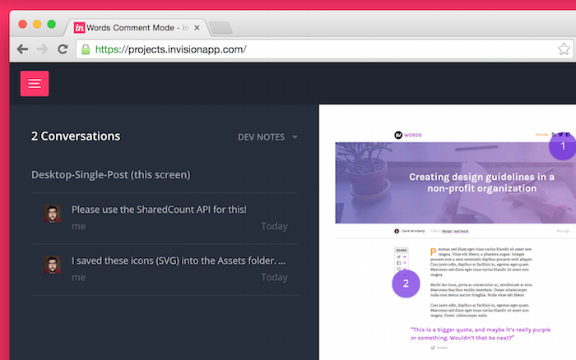

# Chapter 9 of 10 - Design Workflow with Sketch
#to read/Design Workflow with Sketch#

In our last section, we talked about the handoff: that moment between design and development, and how to navigate it. The handoff and the kickoff might sound similar, but here's the difference: [a handoff is for passing actual assets, and a kickoff is for deciding what to do with them.](https://twitter.com/intent/tweet?text=%22a%20handoff%20is%20for%20passing%20actual%20assets,%20and%20a%20kickoff%20is%20for%20deciding%20what%20to%20do%20with%20them.%22+http://bit.ly/1VJg2Kh%20via%20@InVisionApp)

 

My favorite build kickoff meeting involves getting everyone involved into a single meeting (LiveShare or IRL—take your pick) and walking through all the screens, feature by feature. Anything that looks tricky or might take some scripting to accomplish? Take a few moments to discuss how you're going to pull it off, including how long it might take and what tools/methods would fit.

## Present approved prototypes

During a build kickoff, there's a chance you'll have some new faces around the table (or in the chat window). Developers and engineers aren't always around during the design process, and the kickoff meeting is your chance to bring them all up to speed.

It's imperative to walk all the developers and engineers through the prototypes with the same care you had during the design rounds. Most often, I'll send the approved prototypes ahead of time so everyone has a chance to explore and prepare questions.

If you're a designer who dabbles in the frontend, your presentation for a group of developers might be staggeringly different than it was for the marketing team and project managers. That's great, and the developers will appreciate it—just make sure you don't leave anything obvious out.

## Estimating development timelines

This one might be a shocker, but the only way to estimate how long something will take to build is to talk to the person (or people) building it. Sometimes with a larger design (and larger team), it's easy to estimate on too large a scale.

Depending on the project management methodology your team uses, there are endless ways to estimate and track time, progress, and velocity. We won't get into that here—just make sure everyone on the team knows how long things are expected to take, and make everyone aware when anything changes.

Discuss existing code/planned libraries

Even with the most careful planning, it's possible to end up with a design that isn't feasible for the build's architecture. Or, more often, that the existing code (or the library/plugin the developers plan to use) does something *just slightly* different than the way you've designed it. Or it might simply take too much time.

Now don't panic and freak out, but you may have to change your design to more closely align with the current features and resources available. Or you might be able to explain the scary new feature and move forward. You won't know until the moment hits, but here's a few tips for late-in-the-game changes:

* If something on the frontend is causing a snag in some of the finer points of your design, stop and consider how much you really need them. Learning when to compromise (and cut corners) is a huge bonus on a small, quick-moving team.

* **Revise the prototype along the way.** With InVision Sync installed, it's easy to continually update your prototype. Anytime you've made a meaningful change in your .sketch document, sync the improvements up to the prototype. Files with the same mean are updated in-place with no hassle, and everyone can keep track of the forward progress.

* **Launch now, customize later.** If there's an off-the-shelf solution that lets your team skip a lot of work, pull the trigger. During your build kickoff, decide what's essential for launch and what you can return and improve on later.

## Leave Dev Notes for the developers

Inside your InVision prototype, you can leave Dev Notes for the folks doing the building. It's a special type of comment that lets you leave technical notes and specific instructions for the developers and engineers on the project.

Creating a new Dev Note

Lots of times I leave a lot of Dev Notes during the actual kickoff meeting. Right as we sit around discussing the build, I'll log important tidbits as comments into the prototype.

Little hints, logged in-context, are a great boost when it comes time to build out the design.

Doing so is simple. Just enter **Comment Mode** and select **Dev Note** as the comment type. When a developer views the prototype, it's easy to filter comments by Dev Note only, seeing just the meat and potatoes that will help push the build along.

## In the line of fire

As the build gets underway, get ready to answer lots of questions. *"How is this supposed to work?"* and *"What do we do when there's no results to show?"* will be flying at you from all angles.

Earlier in the build, it was the designer's job to ask lots of questions. Now you're on the hook for the answers, and we've gotta move fast. Keep pace with the developers, and provide a visual design fix whenever possible.

In the next and final chapter of this e-course, we'll talk about all things *post launch*.